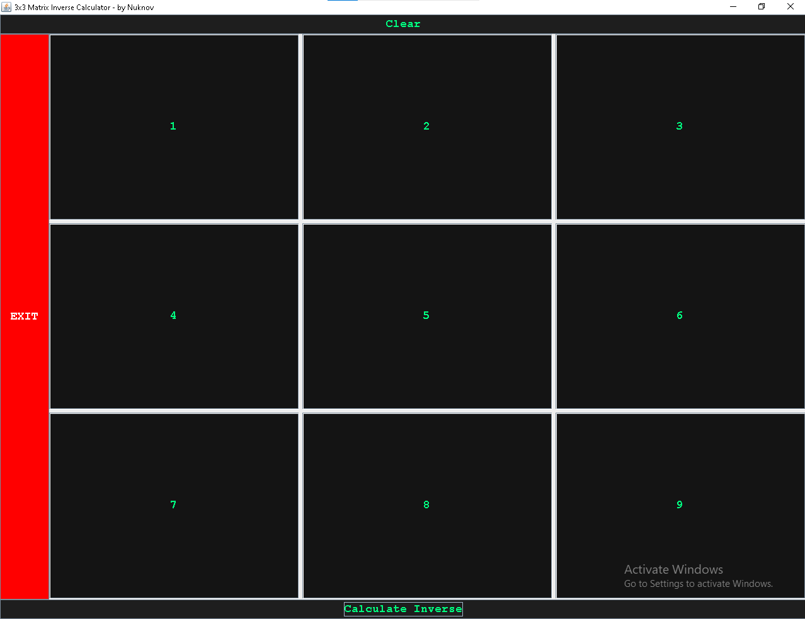

# Matrix Inverse Calculator

A Java Swing-based GUI application that calculates the **inverse of a 3x3 matrix**, along with its **determinant**, **adjoint**, and **transpose**. Developed by **Ahmed Naveed** aka **Nuknov**. Normal programming project for students.

---

## Screenshot

---

## Features

- Graphical User Interface using Java Swing
- Calculates:
  - Determinant
  - Transpose
  - Adjoint
  - Inverse (with fractional precision)
- Colorful styled buttons
- Clean logic with OOP (classes, inheritance, overriding)
- Executable `.exe` file included
- It saves the result in an output file in the same folder
- ✅ **Accuracy Rate: 98.01%**
- https://github.com/Nuknov

---

## How to Run

### If using source code:

1. Ensure you have **Java JDK** installed.
2. Open the `GUIWrapper.java` file in **VS Code** or **IntelliJ**.
3. Run the `main()` method from `GUIWrapper`.

### If using `.exe`:

Just double-click `matrix_inverse_gui.exe`  
No Java installation required.

---

## Author

**Ahmed Naveed**  
`Nuknov`  
https://github.com/Nuknov

---

## License

This project is licensed under the **MIT License**.  
See the `LICENSE` file for more info.

---

# JAVA-3x3-inverse
A Java GUI-based 3x3 matrix inverse calculator with .exe export. A small programming project for students.
